<div align="center">


[](https://git.io/typing-svg)

<br/>


[](https://www.linkedin.com/in/harsh-vardhan-gupta-04a946327)
[](mailto:gharshvardhan73@gmail.com)

</div>

---

### 🧠 About Me

```yaml
name     : Harsh Vardhan Gupta
role     : MCA Student · Data Engineer (in progress) · Backend Engineer (in progress)
education: VIT — MCA, CGPA 8.15/10 (2025–2027) · CCS University, Meerut — BCA, CGPA 8.0/10 (2022–2025)
location : Meerut, UP, India 🇮🇳
focus    : Python · SQL · ETL Pipelines · Data Warehousing · REST APIs
building : ETL pipelines, automated data workflows & cloud-based data solutions
grinding : 150+ DSA Problems Solved (NeetCode patterns)
learning : Apache Airflow · Cloud Data Engineering (AWS/Azure/GCP) · System Design
target   : Data Engineer / Backend Developer
```

---

### ⚡ Tech Stack

<p align="center">
  
</p>

**Languages:** Python · Java · SQL · C · C++
**Data Engineering & ETL:** Pandas · NumPy · PySpark · Apache Airflow · APScheduler · REST API Integration
**Databases:** MySQL · PostgreSQL · MongoDB · SQLite
**Data Modeling:** Normalization · Dimensional Modeling · Star Schema · Fact & Dimension Tables
**Cloud & Big Data:** AWS (S3, EC2, Lambda) · Azure Data Factory · GCP BigQuery · Databricks
**BI & Reporting:** Power BI · Advanced Excel (Pivot Tables, OpenPyXL)
**Tools:** Git · GitHub · Postman · VS Code · Jupyter Notebook

---

### 🚀 Featured Projects

<table align="center">
  <tr>
    <td align="center" width="50%">
      ⚡ <b>Real-Time Auction Platform</b><br/>
      <sub>BullMQ · Socket.io · Redis · MongoDB (Team of 5)</sub>
    </td>
    <td align="center" width="50%">
      📊 <b>ETL Pipeline & Sales Analytics</b><br/>
      <sub>Pandas · SQLite · Power BI</sub>
    </td>
  </tr>
  <tr>
    <td align="center" colspan="2">
      🌿 <b>Distortion-Adaptive Preprocessing for Leaf Disease Classification</b><br/>
      <sub>OpenCV · ResNet50 · VGG16</sub>
    </td>
  </tr>
</table>

---

### 📜 Certifications

- Python Programming — HackerRank
- Google Analytics — Google
- Version Control (Git & GitHub) — Meta

---

### 📈 GitHub Activity Graph

<div align="center">
  
</div>

---

### 🐍 Contribution Snake

<div align="center">
  
</div>

---

### 🤝 Let's Connect


[](https://www.linkedin.com/in/harsh-vardhan-gupta-04a946327)
[](mailto:gharshvardhan73@gmail.com)

</div>

---

<div align="center">

</div>
